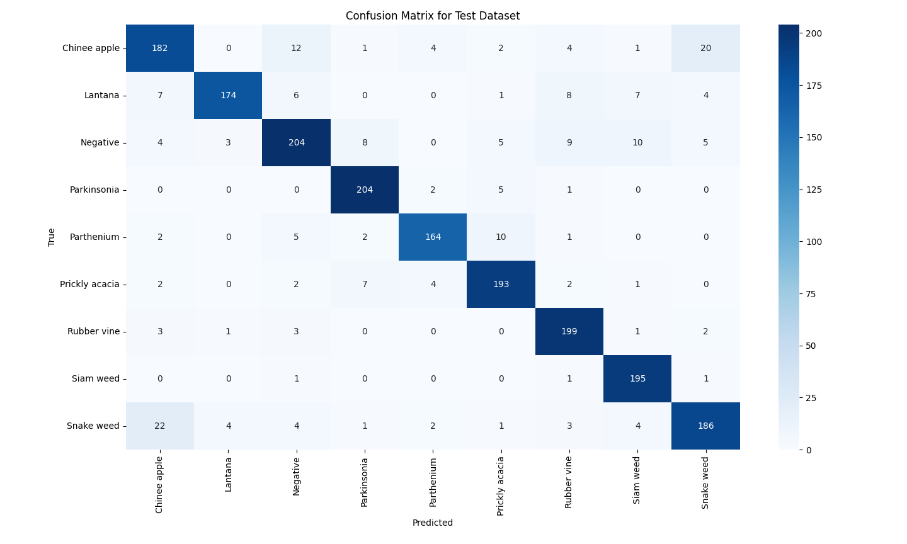
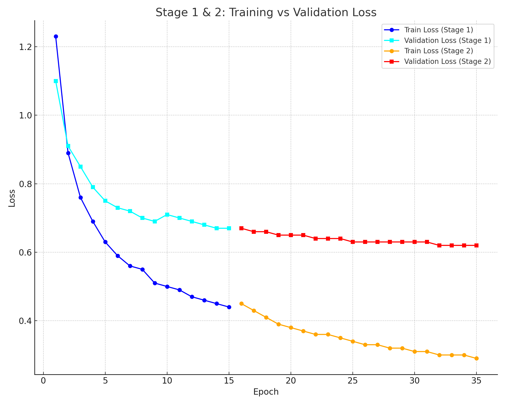
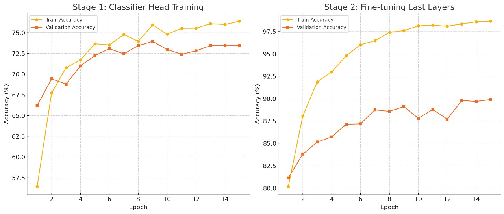

#  AI-Based Weed Detection Using Image Processing

[](https://www.python.org/downloads/)
[](https://pytorch.org/)
[](#)


> **A deep learning–based image classification system for automated weed detection using EfficientNet-B0 and transfer learning, evaluated on the public DeepWeeds dataset.**

---

## 📋 Table of Contents

-  [Overview](#overview)
- [Project Motivation](#project-motivation)
- [Key Features](#key-features)
- [Dataset](#dataset)
- [Methodology](#methodology)
- [Model Architecture](#model-architecture)
- [Training Strategy](#training-strategy)
- [Results](#results)
- [Evaluation & Visualizations](#evaluation--visualizations)
- [Installation](#installation)
---

##  Overview

Weeds significantly impact agricultural productivity by competing with crops for nutrients, water, and sunlight. Manual weed identification is labor-intensive and impractical for large-scale farming.

This project explores **deep learning–based image classification** for automated weed detection using **EfficientNet-B0** and **transfer learning** on real-world agricultural images.

---

##  Project Motivation

The goal of this project is to gain practical experience with:

- Real-world computer vision datasets
- Transfer learning using pretrained CNNs
- Image preprocessing and data augmentation
- Model evaluation using interpretable metrics
- Error analysis through visual diagnostics

---

##  Key Features

- Multi-class weed classification (9 classes)
- EfficientNet-B0 pretrained on ImageNet
- Two-stage transfer learning strategy
- Class-wise evaluation using confusion matrix
- Training and validation performance analysis

---

##  Dataset

- **Dataset:** DeepWeeds (Public Dataset)
- **Total Images:** 9,603
- **Classes:** 9  
  - 8 weed species  
  - 1 negative / background class
- **Image Type:** Real-world field images captured under natural conditions

---

##  Methodology

1. Dataset cleaning and validation  
2. Train / Validation / Test split (60 / 20 / 20)  
3. Image resizing, normalization, and augmentation  
4. Transfer learning using EfficientNet-B0  
5. Two-stage training (feature extraction + fine-tuning)  
6. Quantitative and qualitative evaluation  

---

##  Model Architecture

- **Base Model:** EfficientNet-B0 (ImageNet pretrained)
- **Custom Head:**
  - Global Average Pooling
  - Dense layer (256 units, ReLU)
  - Softmax output layer (9 classes)

EfficientNet-B0 was selected due to its strong **accuracy–efficiency trade-off**, making it suitable for practical applications.

---

##  Training Strategy

### Stage 1 – Feature Extraction
- Backbone frozen
- Classifier head trained
- 15 epochs

### Stage 2 – Fine-Tuning
- Final convolutional layers unfrozen
- Reduced learning rate
- 15 epochs

**Optimizer:** SGD with Momentum  
**Loss Function:** Categorical Cross-Entropy  
**Batch Size:** 32  

---

##  Results

| Metric | Score |
|------|------|
| Test Accuracy | **88.50%** |
| Macro Precision | 88.77% |
| Macro Recall | 88.81% |
| Macro F1-Score | 88.68% |

---
##  Evaluation & Visualizations

This section presents a detailed visual analysis of the model’s performance on the test dataset.  
The plots help in understanding **class-wise behavior**, **training stability**, and **generalization performance**.

---

###  Confusion Matrix (Test Set)

The confusion matrix provides a **class-wise breakdown of predictions**, where:

- **Diagonal values** represent correctly classified samples.
- **Off-diagonal values** indicate misclassifications between weed classes.

Key observations:
- Classes such as **Parkinsonia**, **Siam weed**, and **Rubber vine** show strong diagonal dominance, indicating high classification confidence.
- Some confusion is observed between visually similar classes such as **Chinee apple** and **Snake weed**, which is expected due to overlapping leaf shapes and textures.
- The **Negative (background)** class is largely well-separated, showing the model’s ability to distinguish weeds from non-weed vegetation.

This visualization helps identify **which weed species are harder to classify** and guides future improvements.

<p align="center">
  
</p>

---

###  Training vs Validation Loss (Stage 1 & Stage 2)

This plot illustrates the **loss curves** during both training stages:

- **Stage 1 (Feature Extraction):**
  - The pretrained EfficientNet-B0 backbone is frozen.
  - Loss decreases steadily, showing that the classifier head learns meaningful representations.
- **Stage 2 (Fine-Tuning):**
  - The final convolutional layers are unfrozen.
  - Training loss decreases further, while validation loss stabilizes.


<p align="center">
  
</p>

---

###  Training & Validation Accuracy

This plot shows the **accuracy progression** across both training stages:

- **Stage 1:** Validation accuracy improves steadily as the classifier adapts to weed-specific features.
- **Stage 2:** Fine-tuning leads to a noticeable accuracy boost, confirming the benefit of unfreezing higher-level layers.
- Validation accuracy follows the training trend closely, suggesting good generalization.


<p align="center">
  
</p>

---


##  Installation

### Prerequisites
- Python 3.8+
- 8 GB RAM recommended
- GPU optional (CPU supported)

### Clone Repository

```bash
git clone https://github.com/Shashankshekhar13/weed-detection-project.git
cd weed-detection-project
